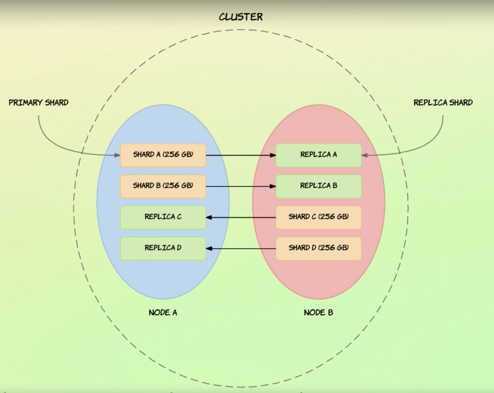

# ELASTIC SEARCH

[Elasticsearch v 1]()

[Elasticsearch v 2]()

[Elasticsearch v 3](https://medium.com/machinereading/elasticsearch-%E0%B8%A5%E0%B8%B8%E0%B8%A2%E0%B8%A0%E0%B8%B2%E0%B8%84%E0%B8%AA%E0%B8%99%E0%B8%B2%E0%B8%A1-%E0%B8%95%E0%B8%AD%E0%B8%99%E0%B8%97%E0%B8%B5%E0%B9%88-3-750473c46a04)

- Node and Clusters
- indices & documents
- shardin
- replication
- searching for data
- documents acrooss shards

# NODE AND CLUSTERS

> A node is a server that stores data and is part of what is called a cluster.

> A cluster is a collection of nodes, i.e servers, and each node contains a part of the cluster's data, being the data that you add to the cluster.


Both clusters and nodes are identified by unique names.

## Node

name for nodes is a Universally Unique Identifier, also referred to as a UUID. The names of nodes are important because that is how you can identify which physical or virtual machines correspond to which Elasticsearch nodes. By default, nodes join a cluster named “elasticsearch,” but you can configure nodes to join a specific cluster by specifying its name.

## Clusters

For clusters, the default name is “elasticsearch” in all lowercase letters, and the default

# INDICES & DOCUMENTS

Documents have IDs assigned to them either automatically by Elasticsearch, or by you
when adding them to an index.
A document is uniquely identified by the index and its ID.
As with clusters and nodes, indices are also identified by names, which must be in all
lowercased letters.


> So to recap documents are added to index, and index are a collection of documents,

# SHARDING


# REPLICATION





# SEARCHING FOR DATA


# DOCUMENTS ACROOSS SHARDS


# CONFIG DEFAULE

- ELASTIC

  > start

  ```javascript
  > cd ~/elasticsearch-6.7.0
  > bin/elasticsearch

  // http://localhost:9200/
  ```

- KIBANA

  > start

  ```javascript
  > cd ~/kibana-6.7.0-darwin-x86_64
  > bin/kibana

    // http://localhost:5601

    // kibana dev-tools
  GET /myindex/mytype/_search // get error
  // <REST verb> / <index> / <Type> / <API>

  > curl -XGET "http://localhost:5601/myindex/mytype/_search" // get error
  ```

# QUERY

- scripts

[How to use scripts](https://www.elastic.co/guide/en/elasticsearch/reference/current/modules-scripting-using.html)

```javascript
// link: http://localhost:9200/product/default/1/_update

// body
{
  "script": "ctx._source.price += 10"
}
```

# NODE COMMAND DOCUMENTS

[node command](https://www.elastic.co/guide/en/elasticsearch/reference/current/cat-nodes.html)

# MAPPING

- dynamic field
- meta fields
- field data types

## [dynamic field mapping](https://www.elastic.co/guide/en/elasticsearch/reference/current/dynamic-field-mapping.html#date-detection)


## META FIELDS

- `_index` Contains the name of the index to which a document belongs.
- `_id` Stores the ID of documents.
- `_source` Contains the original JSON object used when indexing a document.
- `_field_name` Contains the names of every field that contains a non-null value.
- `_routing` Stores the value used to route a document to a shard.
- `_version` Stores the internal version of a document.
- `_meta` May be used to store custom data that is left untouched by Elasticsearch.

---

## FIELD DATA TYPES

1. Core Data types
2. Complex Data types
3. Geo Data types
4. Specialized Data types

[1]. CORE DATA TYPES

> Primitive data types as seen in programming languages, e.g. strings, integers, dates, etc.

- `Text Data Type` (text)
  used to index full-text value such as descriptions. values are analyzed.
- `Keyword Data Type` (keyword) used for structured data (tags, categories, e-mail address, ...). Not analyzed. Typically used for filtering and aggregations.
- `Numeric Data Types` Basic numeric data types, most of which are found in various programming languages. [float, long, shor, byte, integer, double, half_float, scaled_float]
- `Date Data Type` (date) Represents dates as either a string, long, or integer. The date format may be configured. `"2007-12-04", "2007-12-04T11:31:54Z", 1196767914`
- `Booelan Data Type` (boolean) true, false
- `Binary Data Type` (binary) Accepts a Base64 encoded binary value. Not stored by default.
- `Range Data Type` used for range values such as date ranges or numeric rages(e.g. 10-20).
  [integer_range, float_ragne, long_range, double_range, date_range], { "gte": 10, "lte": 20}

[2]. COMPLEX DATA TYPE

> Data types that are not primitive, but are more complex in nature, e.g. arrays and objects.

- `Object Data Type` Added as JSON objects stored as key-value pairs internally. May contain nested objects.

```javascript
// index time
{
  "name": {
    "firstName": "Ro",
    "lastName": "Mantic"
  }
}

// stored
{
  "name.firstName": "Ro",
  "name.lastname": "Mantic",
}
```

- `Array Data Type` Not an actual data type, because each field may contain multiple values by default.
  - [1, 2, 4]
  - ["one", "two"]
  - ~~["one", 1, "two"]~~
  - [1, [2, 3]] -> [1, 2, 3]
- `Array of objects` <span style="color:red">Associations between object values are lost!!!!</span>

```javascript
{
  "persons": [
    {"name": "Ro", "age": 28},
    {"name": "Foo", "age": 30}
  ]
}

// becames
{
  "persons.name": ["Ro", "Foo"],
  "persons.age": [28, 30]
}

```

- `Nested Data Type` (nested) Specialized version of the object data type. Enables arrays of objects to be querified independently of each other.

[3]. GEO DATA TYPE

> Data types that are used for geographical data.

- `Geo-point Data Type` (geo_point) Accepts latitude-longitude pairs. used for various geographical operations.

```javascript
// 1
{
  "location": {
    "lat": 33.522323,
    "lon": -87.35662
  }
}

// 2
{
  "loaction": "drm3btev3e86"
}

// 3
{
  "loaction": "33.453424, -87.242424"
}

// 4
{
  "loaction": [-86.8867833, 33.565883]
}
```

- `Geo-shape Data Type` (geo_shape) Used for more geographical shapes such as polygons, circles, etc. point, polygon, linestring, multipoint, multilinestring, multipolygon, geometrycollection, envelope, circle

SPECIALIZED DATA TYPES

> Data types with a very specific purpose, e.g. storing IP addresses.

- `IP Data type` (ip) Used for storing IPv4 and IPv6 IP addresses. "192.168.1.1"
- `Completion Data type` (completion) Used to provide auto-completion ("search-as-you-type") functionality. Optimized for quick lookups.
- `Attachment Data type` (attachment) Requires the Ingest attachment processor plugin. Used to make text from various document formats searchable (e.g. PPT, PDF, RTF...)
  Uses Apache Tika interally for text recognition.

---

MAPPING PARAMETERS

- `coerce` Can be sued to disable coercion (automatically cleaning up values).
  "5" -> 5, "5.0" -> 5, 5.0 -> 5
- `copy_to` Enables you to create custom fields. Copies field values into a given field. Copies values, not terms.

```javascript
{
  "first_name": {
    "type": "text",
    "copy_to": "full_name"
  },
  "last_name": {
    "type": "text",
    "copy_to": "full_name"
  },
  "full_name": {
    "type": "text"
  }
}
```

- `dynamic` Enables or disables adding fields to documents or inner object dynamically

```javascript
{
  "mappings": {
    "default": {
      "dynamic": false,
      "properties": {
        "name": {
          "dynamic": true,
          "properties": {}
        }
      }
    }
  }
}
```

- `properties` Contains field mappins, ether at the top level of documents, or within inner objects.

```javascript
{
  "mappings": {
    "default": {
      "properties": {
        "name": {
          "properties": {
            "first_name": {"type": "text" },
            "last_name": {"type": "text"}
          }
        }
      }
    }
  }
}
```

- `norms` Whether or not to disable storing norms (sued for relevance scores).

```javascript
"properties": {
  "full_name": {
    "type": "text",
    "norms": false
  }
}
```

- `format` Defines the format for date fields. "yyy-MM-dd", "epoch_millis", "epoch_second", ...
  default: "strict_date_optional_time || epoch_millis"
- `null_value` Replaces NULL values with the specified value.

```javascript
 "properties": {
   "discount" {
     "type": "integer",
     "null_value": 0
   }
 }
```

- `fields` Used to index fields in different ways.

# ANALYSIS AND ANALYZERS


# Match Query

```javascript
// kibana link -> http://localhost:5601/app/kibana#/dev_tools/console?_g=()
// kibana body -> GET /product/default/_search

// insomnia -> GET http://localhost:9200/product/default/_search
// insomnia body
// search by field name lobster === Lobster
{
  "query": {
    "match": {
      "name": "Lobster"
    }
  }
}

// search by field name lobster !== Lobster
{
	"query":{
		"term":{
			"name": "Lobster"
		}
	}
}
```

query multiple term

```javascript
GET /product/default/_search
{
  "query": {
    "terms": {
      "tags.keyword": [ "Soup", "Cake" ]
    }
  }
}
```

# Full Text Query (match query)
